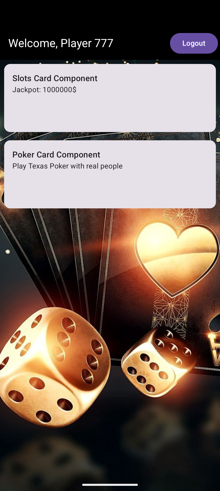

# 🎰 MyCasino Kotlin Multiplatform App

**Kotlin Multiplatform (KMP)** mobile application built for Android and iOS. This project demonstrates strict separation of concerns, decoupling of platform layers, and an advanced **Server-Driven UI (SDUI) Card Architecture**.

---

## 🛠️ Tech Stack & Architecture Libraries

The application uses an entirely shared business logic engine combined with a declarative UI layer:

*   **UI Framework:** [Compose Multiplatform]
*   **Networking:** [Ktor Client](https://ktor.io) with a specialized `MockEngine` for deterministic and robust JSON API stream responses.
*   **Local Caching:** [SQLDelight](https://github.io) for type-safe, multiplatform SQLite database storage.
*   **Dependency Injection:** [Koin](https://insert-koin.io) to manage native constructor-based DI across repositories, use cases, and ViewModels.
*   **Serialization:** [Kotlinx Serialization] for type-safe JSON payloads and argument navigation routes.
*   **Navigation:** `androidx.navigation:navigation-compose` for structural type-safe path control.
*   **Analytics:** [Analytics provider]

---

## 🏗️ Architectural Pattern

The project strictly follows **Clean Architecture principles** and **Separation of Concerns**. Code is isolated into a **layered feature-driven structure** within the `shared` module, ensuring that components are independently testable and completely swappable.

### Core Architecture Rules:
1. **Domain Layer (The Brain):** Pure Kotlin logic. It defines business entities and Use Cases, and it is **completely unaware** of UI libraries or remote source frameworks (no Ktor or DB imports).
2. **Data Layer (The Source):** Implements the repository contracts defined by the Domain Layer. It orchestrates local caching (SQLDelight) and remote network endpoints (Ktor).
3. **Presentation Layer (The State Machine):** Houses `ViewModels` and descriptive `UiState` objects. ViewModels expose state streams observed reactively by the Compose UI.

---

## 📂 Project Directory Structure

```text
shared/
├── src/commonMain/kotlin/com/example/mycasino/
│   ├── core/                      # Core infrastructure & global definitions
│   │   ├── network/               # Ktor HttpClient configurations & MockEngine setup
│   │   ├── database/              # SQLDelight database drivers and schema configurations
│   │   └── presentation/          # Global UI contracts, state objects, and layout factories
│   │
│   ├── di/                        # App-wide Koin Dependency Injection modules
│   │
│   └── feature/                   # Feature-driven modules (Enforcing Clean Architecture)
│       ├── auth/                  # Unified Authentication Feature
│       │   ├── data/              # AuthRepositoryImpl, Request/Response DTOs
│       │   ├── domain/            # User model, Login/Register UseCases, Repository Interfaces
│       │   └── presentation/      # LoginScreen, RegisterScreen, AuthViewModel, AuthState
│       │
│       └── lobby/                 # Dynamic Casino Lobby orchestration
│           ├── domain/            # Layout contracts & Layout-fetching UseCases
│           ├── presentation/      # Orchestrated LobbyScreen, Master Layout ViewModel
│           │
│           └── slots/             # Independent Slots Card feature (Micro-architecture)
│               ├── data/          # SlotsRepositoryImpl hitting specific sub-endpoints
│               ├── domain/        # Slots business rules & UseCases
│               └── presentation/  # SlotsCardComponent, SlotsCardViewModel, Slots UI Card
```

---

## 🎴 Advanced Feature: The Card Architecture (Server-Driven UI)

To ensure team scalability and isolated crash boundaries, the casino lobby utilizes a custom **Card Architecture**. 

Instead of treating the home screen as a rigid, monolithic data model, the lobby behaves as a **dynamic orchestrator of independent micro-features**.





